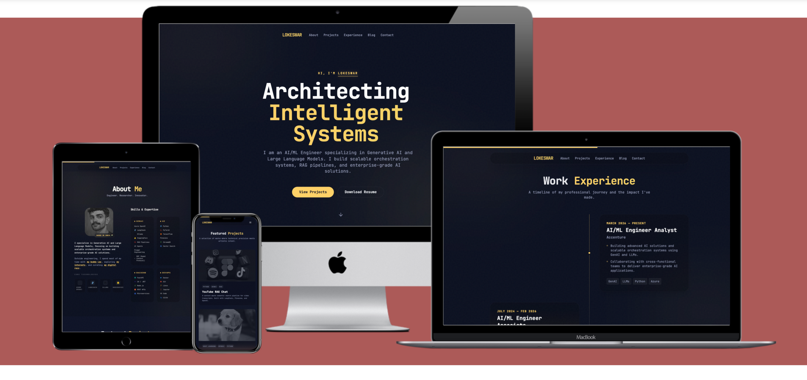

# 🌌 Lokeswar ⚡ | Gen AI Engineer

> **[Explore the Live Vibe →](https://lokeshwarlakhi.github.io/)**

To be honest, I mostly vibe-coded this into existence. It's a cinematic dashboard for my technical world—best experienced live. 

---



---

## 🏗️ Repository Architecture

This codebase is crafted to be extremely clean, modular, and easy to navigate:

```text
portfolio/
├── public/                 # Static assets served directly (images, sitemaps, robots)
│   ├── imgs/               # Custom category images (leo, movies, gallery, tech icons)
│   ├── robots.txt          # Search engine crawling rules (SEO)
│   └── sitemap.xml         # Auto-generated route index (SEO)
├── src/                    # Primary application codebase
│   ├── blogs/              # Raw Markdown (.md) editorial publications
│   ├── components/         # Modular React components
│   │   ├── layout/         # Base layout wrappers (Navbar, Footer)
│   │   ├── sections/       # Feature sections (Hero, About, TechStack, Projects, Contact)
│   │   └── ui/             # Reusable UX utilities (CursorGlow, ScrollProgress, Section)
│   ├── data/               # Centralized config source-of-truth (siteData.ts)
│   ├── lib/                # Shared utilities & services (blog parsing, EmailJS, class merge)
│   ├── pages/              # Primary routing views (Home, BlogArchive, BlogDetail, Recs, Leo)
│   ├── types/              # Type-safe TypeScript descriptors (index.ts)
│   ├── App.tsx             # Root router & layout mounting
│   ├── index.css           # Styling system (Tailwind directives & custom Markdown classes)
│   └── main.tsx            # DOM initialization
├── index.html              # Primary entry HTML document (SEO & custom JSON-LD schemas)
├── tailwind.config.js      # Styling scale config
└── vite.config.ts          # Bundler and deployment compiler config
```

---

## ⚡ Quickstart & Local Setup

### 1. Prerequisites
Ensure you have **Node.js** (v18+) and **npm** installed on your workstation.

### 2. Installation
Clone this repository and download the optimized package dependencies:
```bash
git clone https://github.com/lokeshwarlakhi/lokeshwarlakhi.github.io.git
cd lokeshwarlakhi.github.io
npm install
```

### 3. Local Development
Run the local Vite dev server with Hot Module Replacement (HMR):
```bash
npm run dev
```
Open **[http://localhost:5173](http://localhost:5173)** in your browser.

---

## 🎨 Complete Customization Guide

### 1. The Source of Truth (`src/data/siteData.ts`)
The entire application is completely data-driven. You can customize the name, biography, technical categories, experience timeline, and digital recommendations directly in this single file—no JSX manipulation required.

### 2. Dynamic Blog Publications (`src/blogs/`)
Our custom parsing engine automatically reads, compiles, and calculates reading times for all Markdown files in this directory.
To write a new blog post:
1. Create a `.md` file in `src/blogs/` (e.g. `scaling-fastapi.md`).
2. Populate the document frontmatter at the top:
   ```markdown
   ---
   title: "Scaling FastAPI Services"
   date: "2026-05-18"
   description: "Architecting high-performance asynchronous REST endpoints."
   tags: ["FastAPI", "Python", "Engineering"]
   cover: "/imgs/gallery/fastapi_cover.jpeg"
   ---
   # Your Markdown content starts here...
   ```

### 3. Interactive Contact Form (EmailJS)
The contact form compiles and submits client requests using **EmailJS**, making email routing 100% functional on a static host.
1. Create your template on [EmailJS.com](https://www.emailjs.com/).
2. Define template variables: `{{from_name}}`, `{{from_email}}`, `{{subject}}`, `{{message}}`, and `{{timestamp}}`.
3. Create a `.env` file in the root workspace and provide your keys:
   ```env
   VITE_EMAILJS_SERVICE_ID=your_service_id
   VITE_EMAILJS_TEMPLATE_ID=your_template_id
   VITE_EMAILJS_PUBLIC_KEY=your_public_key
   ```

### 4. High-Signal Newsletter (Buttondown)
Integrated directly with **Buttondown** to manage mailing lists.
1. Create an account at [Buttondown.email](https://buttondown.email/).
2. Define your newsletter account name in your `.env` file:
   ```env
   VITE_BUTTONDOWN_USERNAME=your_buttondown_username
   ```
3. Set your Buttondown confirmation redirect link to `https://yourusername.github.io/#/thanks` to direct subscribers to your hidden witty thank you page!

---

## 🚢 Automated Production Deployment

To compile and deploy the latest codebase live to GitHub Pages, execute one of the automated deploy pipelines:

*   **Deploy Build Only** (Deploys current code to GitHub Pages with NO version bump or tag):
    ```bash
    npm run deploy
    ```
*   **Patch Release** (Bumps patch version, e.g. `1.0.1` -> `1.0.2`):
    ```bash
    npm run deploy:patch
    ```
*   **Feature / Minor Release** (Bumps minor version, e.g. `1.0.1` -> `1.1.0`):
    ```bash
    npm run deploy:minor
    ```
*   **Major Release** (Bumps major version, e.g. `1.0.1` -> `2.0.0`):
    ```bash
    npm run deploy:major
    ```

**What happens**: The version-bumping scripts (`deploy`, `deploy:minor`, `deploy:major`) automatically trigger the respective SemVer version bump, commit the manifest changes, tag the commit, build the React app, deploy the static assets to GitHub Pages, and push the new release tag to GitHub. The build-only script (`deploy:build`) simply compiles and publishes your live site without any version modifications or Git tags.


---
<div align="center">
  Built with ❤️ and questionable amounts of coffee.
</div>
